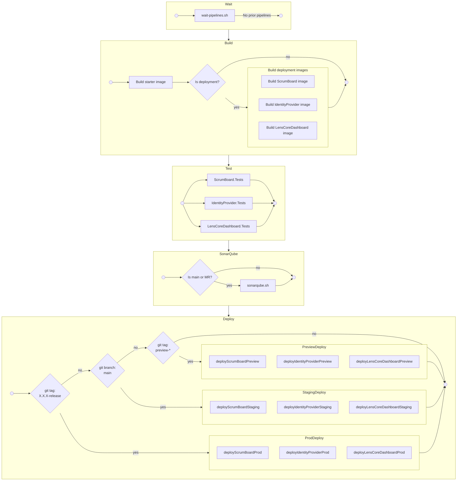

# ScrumBoard (AKA LENS Resurrected)

## Quickstart

The `dev_utils.sh` is a helpful script to get up and running for ScrumBoard development. In short, it automatically builds and loads external dependencies like the identity provider / user dashboard and mariadb database. If you're just going to be working on the ScrumBoard project alone, you can easily get underway by running the following commands (`docker` and `docker compose` must be installed on your machine first):

First, for building the necessary Docker images:
```shell
./dev_utils.sh init
```

Second, for starting the dependent and auxiliary services:
```shell
./dev_utils.sh setup-scrumboard-dev
```

From this point you have everything you need to run the ScrumBoard. Do this either through your IDE, or via the commands:
```shell
cd ScrumBoard
dotnet watch
```

To clean up the services later, run the following command:
```shell
./dev_utils.sh tear-down
```

## Branching guidelines

- New feature branches should be branched off directly from `main` and named in `PascalCase`
- All merge requests should be targeted at `main`

## CI

During the CI pipelines, a single docker image is built with the entire solution for use in testing and code analysis.
Actual deployments are managed by pulling just the necessary files from this image for the deployed applications
(`ScrumBoard`, `IdentityProvider`, `LensCoreDashboard`) to build a minimal image for each. The initial image is based
on the Microsoft's docker image containing the ASP.Net core **SDK**, while the minimal images are based on the image
for just the ASP.Net core **runtime**.

## Deployments

- Pushes made to the `main` branch will deploy to [our development Staging environment](https://csse-scrum2.canterbury.ac.nz/staging/)
- Commits tagged in the form `preview-*` will deploy to [our development Preview environment](https://csse-scrum2.canterbury.ac.nz/preview/)
- Commits tagged in the form `X.X.X-release` will deploy to the [**Live Production environment**](https://scrumboard.csse.canterbury.ac.nz/)

### Remotely hosted environments for developer testing

The UC virtual machine `csse-scrum2` hosts two environments for developers to use for QA and ad-hoc testing, `staging` 
and `test` respectively. Both of these environments contain the following resources:
- ScrumBoard, publicly accessible at root url, created during pipeline;
- IdentityProvider, not publicly accessible, created during pipeline;
- LensCoreDashboard, publicly accessible from `{root}/dashboard/`, created during pipeline;
- MariaDB instance running, not publicly accessible except by SSH tunnel, must be created manually;

## CI/CD flow diagram


