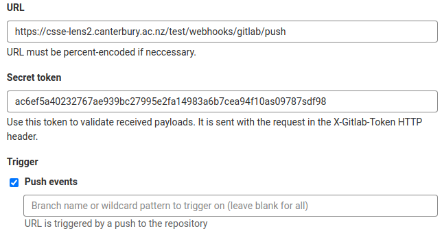
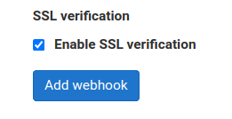
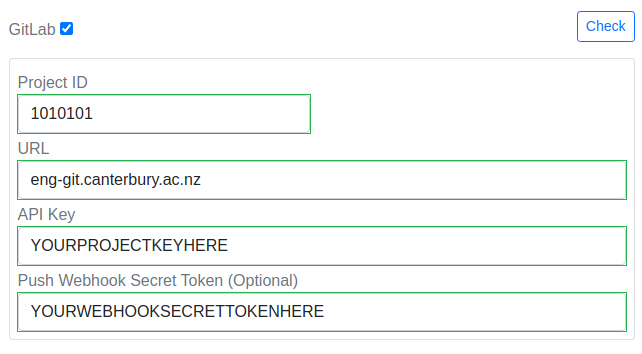
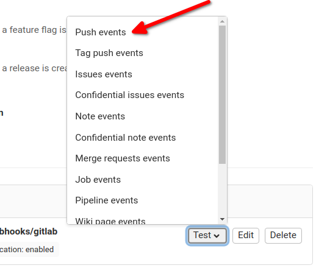

# Scrumboard
This project contains the main Scrumboard application. The Identity Provider project must be run alongside this application for user authorisation against UC's LDAP servers.

# ScrumBoard Configuration

The application primarily sources its configuration values from the `appsettings.{Environment}.json` files located in the project root. You can reference the `appsettings.Development.json` for an example of the default configurations. Additionally, these configuration values can be overridden by environment variables for added flexibility and security (such as when creating docker containers for deployments).

## Configuration Variables

Here's a list of the main configuration variables available and a brief description for each:

- `Urls`: The URLs for the application, separated by semicolons (e.g., `http://localhost:9000;https://localhost:9001`)

- `AppBaseUrl`: Any base for the application URL, such as if running behind a reverse proxy. Leave as empty string for no prefix.

- `IdentityProviderUrl`: URL pointing to the `IdentityProvider` for authentication.

- `UserCodesPermittedToReadCheckIns`: LDAP user codes for users who are permitted to read others' stand-up check-ins.

- `EnableFeedbackForms`: Flag to enable/disable feedback forms globally.

- `EnableSeedData`: Flag to determine if additional sample data should be added to the database on startup. Only enable this in developer environments, all necessary seed data (such as worklog and task tags) will be added regardless of this value.

- `Database`:
  - `UseInMemory`: True to use in-memory database, false to use an actual database instance.
  - `DatabaseName`: Name of the database, always required.
  - `Host`: Database host, required only if not using InMemory. 
  - `Username`: Database username, required only if not using InMemory. 
  - `Password`: Database password, required only if not using InMemory. 
  - `Port`: Database port, required only if not using InMemory.

- `UsageDataDatabase`: Similar to the above Database configuration but specifically for usage data.

- `StudentGuide`:
  - `Enabled`: Feature flag to enable or disable the Student Guide integration. Set to `true` or `false`.
  - `ContentPath`: Path to the directory where Student Guide content will be downloaded, extracted, and stored. The running ScrumBoard process must have complete write access within this directory. May be an absolute path, or a relative path. Relative paths are relative to the ScrumBoard executable, e.g., `ScrumBoard.dll`.
  - `GitlabZipPath`: URL to GitLab API endpoint for downloading a `.zip` archive of the specified repository. This path is suffixed with `?sha=<latest-git-tag>` by the ScrumBoard when updating Student Guide content, so it must end in `archive.zip` with no trailing characters.
  - `GitlabTagPath`: URL to GitLab API endpoint for a list of the repositories' tags. The ScrumBoard will only use the first returned tag for updating, so tags should be sorted by creation date descending (GitLab does this by default).
  - `GitlabAccessToken`: GitLab access token for Student Guide repository; while this can be a personal access token tied to a user account, we recommend creating a dedicated Project Access Token for this integration. Minimum access token role: `developer`. Required access token scopes: `api`, `read_api`, `read_repository`.

- `LiveUpdate`: For configuring the behaviour of live updating (where implemented).
  - `IgnoreSslValidation`: Set to true to skip checking certificates. 

## Overriding with Environment Variables

To override any of the above configurations, you can set environment variables. The environment variables should be named by following the path to the JSON property in the file, with each level separated by a double underscore (__).

```shell
export IdentityProviderUrl=http://localhost:16000
export Database__UseInMemory=false
```

# Student Guide Integration

The Student Guide Integration feature of the ScrumBoard allows for markdown content to be uploaded and rendered dynamically by the ScrumBoard, served to users as a series of web pages. Any GitLab repository can be used so long as the correct configuration (as specified above) has been given, and the files in the repository adhere to the following structure.

## Directory structure and required files

The GitLab repository must contain two root level directories:  
* `parts/` houses all markdown (`.md`) files to be displayed; any subsequent sub-directories will be ignored.
* `imgs/` is where any static media (i.e images) assets must be placed

Only one `.md` file is required to exist: `parts/index.md`. This is the main entry point to the markdown content that users are shown when they first access the Student Guide in the ScrumBoard.

### Example file structure of Student Guide repository
```
├── .gitignore
├── parts
│   ├── index.md
│   ├── course-structure.md
│   └── logging.md
│
└── imgs
    ├── uc-logo.jpg
    └── staff-photo.png
```

## Links in Student Guide markdown files

So long as the required directory structure is adhered to linking to other `.md` files, or embedding images, does not require any deviations from typical markdown practice. 

### Creating a link to another `.md` file

When linking from one markdown file to another, links may take any of following forms:
1. `[My other file](my-other-file)`
1. `[My other file](my-other-file.md)`
1. `[My other file](./my-other-file)`
1. `[My other file](./my-other-file.md)`

### Linking to headers / sections within a markdown file
If you want to link to a header or some other anchor within the current markdown file, use the following format:

`## This is my Header`  
`[Link to header](#link-to-my-header)`

The ID you should be linking to (i.e the text after the `#`) will be the text of the header, where all letters are in lower case, and any special symbols (spaces, brackets, etc.) have been replaced with dashes. 

For more complex headers, an easy way to see the id that has been generated is to inspect the HTML element of the header once it has been rendered, see example image below.

  
_Here we see that the markdown header `### Definitions of Done (DoD)` has been rendered with the ID `definitions-of-done-dod`, and so can be linked to with `[go to definitions of done](#definitions-of-done-dod)`_

Using GitLab style anchor declarations (e.g `## This is my header {header-id}`) are __not__ supported, you must use the ID generated from heading text.

#### Linking to headers / sections within a different markdown file
Links can be made to headers or other anchors in different markdown files too, simply by placing the filename before the `#` anchor ID in the link. Any of the following formats are accepted:

1. `[Link to title section in other file](my-other-file#title)`
1. `[Link to title section in other file](my-other-file.md#title)`
1. `[Link to title section in other file](./my-other-file#title)`
1. `[Link to title section in other file](./my-other-file.md#title)`

### Embedding an image

Embedded images must be included in the `imgs/` directory, and can be linked to in the following form:
* ``

### Links to the outside world

Links to external sites may be present, and follow standard markdown formatting rules.

# GitLab Webhook Integration
This feature is optional and can be enabled/disabled by setting the `EnableWebHooks` variable in Scrumboard's configuration.

## (DEPRECATED) Steps to setup a webhook for a project

1. As a GitLab project maintainer, navigate to the webhook control panel.

2. Add a new webhook with the push trigger pointing at Scrumboard's public URL appended by `/webhooks/gitlab/push`. Make sure to add a secret token as this is required for the next step. 

3. Make sure to enable SSL verification.



4. Ensure the project has valid GitLab credentials set including the secret token. This is found in the Edit Project menu: 

5. Use the test button on the created webhook. A 200 OK response should be received (although no worklog will be added for this test data)

    


Now whenever a user pushes to the project with valid tags, a worklog will be added to their Scrumboard project.

### Valid Commit Message Tags
Commit messages may include the following commands (always prefixed by a #):

* #task - the task ID to link the commit to the task in the system ( e.g. #task T1 )
* #time - a duration ( e.g. #time 1h 30m 10s )
* #pair - two user ids separated by a "," that have worked in pairs for that commit ( e.g. #pair abc123,qwe234 )
* Any number of the available commit tags as defined in 'Log time spent on task' story (i.e. #feature, #fix, #test, #refactor, #document and #chore).

A full example commit message may look like: ```#task T2 #time 30m #pair abc123,qwe234 #fix #refactor Fixed major bug on the registration page```


